# Arcova Engage

**An end-to-end Microsoft Power Platform solution: a model-driven app, a canvas app, seven automation flows, and a Copilot agent embedded with single sign-on, all built on one shared Dataverse data model.**

`Power Apps` · `Power Automate` · `Dataverse` · `Copilot Studio` · `PCF` · `Microsoft Entra ID`

---

## What is this?

Arcova Engage is a complete engagement management solution for **Arcova Advisory**, a fictional mid-size consulting firm. It handles the full lifecycle of a client engagement: intake, triage, assignment, SLA tracking, deliverables, communications, escalation, and closure. The same data is served three ways, a staff workspace, a client self-service portal, and a conversational agent, so each audience gets the experience that fits how they work.

This is a **portfolio project, built to demonstrate the skills covered by the Microsoft AB-410 (Intelligent Applications Builder Associate) certification.** Arcova Advisory is not a real company, and the data is seeded test data. The point of the project is not the fictional firm; it is to show a single solution exercising the full breadth of the Power Platform, model-driven and canvas apps, a full automation backbone, a Dataverse data model, and a Copilot Studio agent integrated into the apps, with the pieces designed to work together as a coherent system rather than as isolated features.

The solution was built and documented in six phases, each with a detailed write-up. A good place to start is the architecture diagram, which shows how the surfaces, automation, and data model relate: [Solution Architecture](docs/architecture/architecture.md). The roles the solution serves, and the user stories behind each capability, are in the [Personas & User Stories](docs/personas/personas.md) document.

---

## Technology stack

- **Microsoft Dataverse**: relational data platform; the shared data model under every surface
- **Power Apps (model-driven)**: the staff-facing Agent Hub
- **Power Apps (canvas)**: the client-facing Client Portal
- **Power Automate**: seven cloud flows for routing, notifications, SLA enforcement, approvals, and escalation
- **Microsoft Copilot Studio**: the Arcova Assist conversational agent
- **Power Apps Component Framework (PCF)**: the control used to embed the agent in the canvas app
- **Microsoft Entra ID**: single sign-on and the security model
- **Microsoft Teams / Approvals**: the human-approval and notification channel
- **Adaptive Cards**: rich response rendering in the Copilot agent

---

## The four surfaces

The solution presents four ways to interact with the same underlying data, each suited to a different audience and purpose.

**Agent Hub (model-driven app).** The staff workspace. Engagement agents use it to triage incoming requests, manage engagements through their lifecycle, and monitor SLA pressure through dashboards. It includes custom security roles, forms, views, business rules, a guided business process flow, and reporting dashboards.

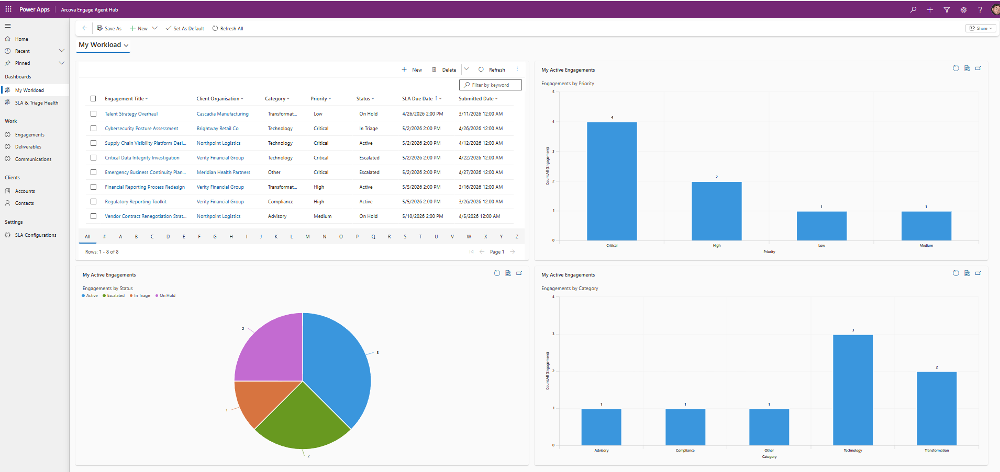
*The My Workload dashboard: a live engagement grid alongside charts breaking down engagements by priority, status, and category.*

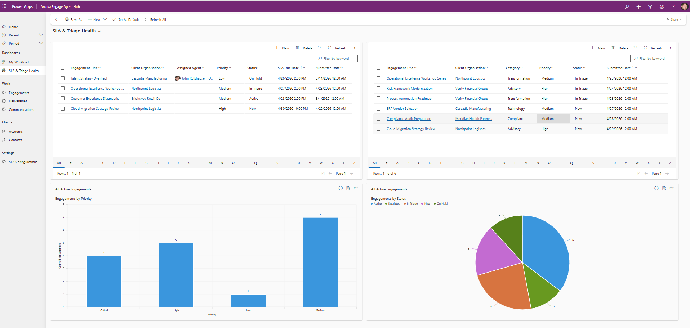
*The SLA & Triage Health dashboard surfaces unassigned and at-risk engagements so nothing falls through the cracks.*

**Client Portal (canvas app).** The client-facing self-service surface. Requesters submit new engagement requests, track status, review deliverables, and add notes, all scoped so they see only their own organization's records. Built on a token-based design system with a reusable navigation component and delegation-safe Dataverse queries.

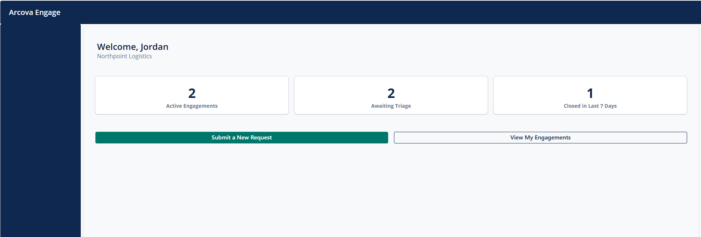
*The portal resolves the signed-in user to their Dataverse identity and greets them with live stats for their organization.*

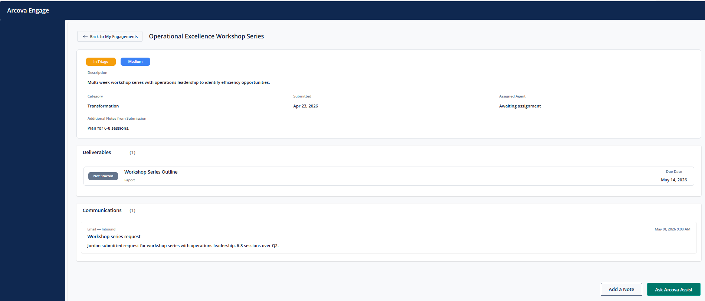
*The engagement detail screen shows the parent engagement with its related deliverables and communication history in one view.*

**Arcova Assist (Copilot Studio agent).** A conversational interface over the same data. It answers status questions, lists deliverables, walks a user through submitting a new request, escalates urgent issues, and answers process and SLA questions from a curated knowledge source. It reaches Dataverse through helper flows and renders results as Adaptive Cards.

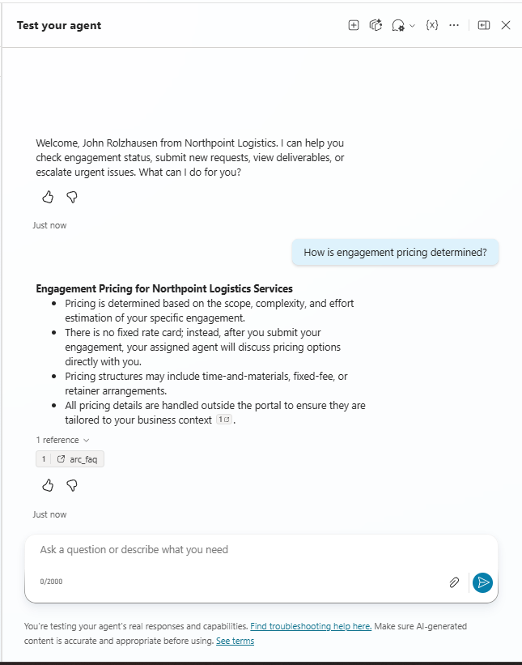

*The agent answers a process question from its Dataverse knowledge source, grounded with a citation back to the source record, and personalized to the user's organization.*

**The embed (Arcova Assist inside the Client Portal).** Rather than living as a separate destination, the agent is embedded directly in the portal's chat screen via a PCF control, with single sign-on so the user's identity flows through automatically. This is what turns three separate surfaces into a single coherent client experience.

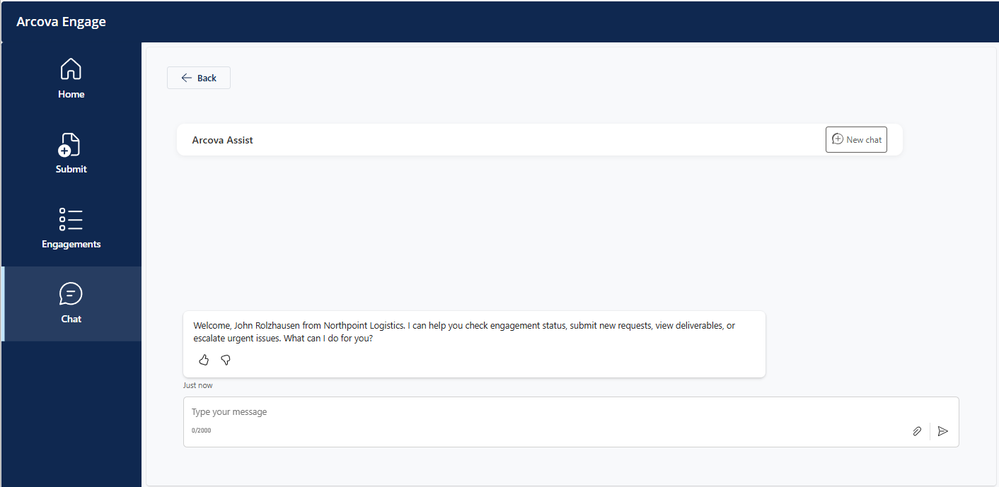
*The agent embedded in the portal's chat screen. Single sign-on carries the user's identity through, so the agent greets them by name with no second login.*

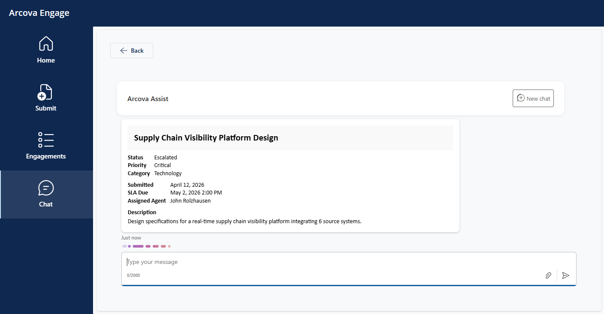
*An engagement status request answered inside the embed: the agent returns a structured Adaptive Card rendered in the canvas app.*

---

## A design system, not just screens

The canvas app is built on a centralized set of design tokens, named constants for color, typography, spacing, and layout, rather than values hardcoded across controls. This keeps the interface consistent and makes a change like adjusting the brand color a single edit rather than a hunt through every screen.

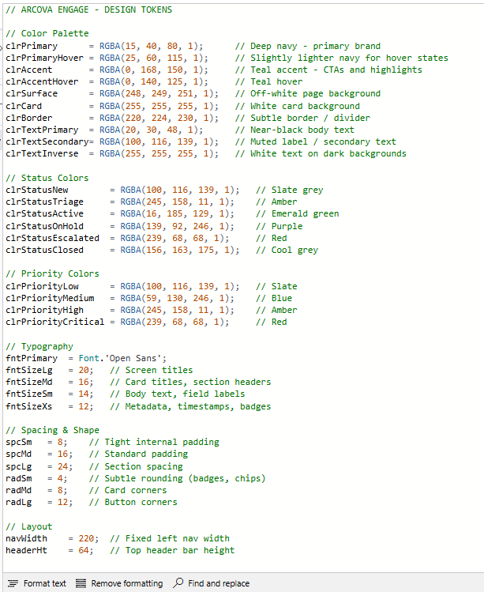

*The design-token definitions: a single source of truth for the app's color palette, status and priority colors, typography, spacing, and layout.*

---

## Selected technical highlights

Three problems from the build are worth describing in some depth, because each required working through a genuine platform constraint rather than following a happy path. Together they span the three things this project was meant to demonstrate: systems thinking, platform integration, and the persistence to push through undocumented behavior.

### Cross-phase composition: one action, a coordinated cascade

The defining characteristic of Arcova Engage is that a single user action sets off a coordinated chain of automated behavior across infrastructure built in different phases. When a requester submits an engagement through the embedded Copilot agent, the agent's helper flow creates the Dataverse row, and that one write triggers a cascade: a Phase 3 flow auto-populates the submitted date, the Phase 3 intake router looks up the SLA configuration and the default agent for that category, calculates the SLA due date, assigns the engagement, sends a confirmation email, and writes an audit record, while the Phase 1 business process flow activates to begin tracking the engagement through its lifecycle. Six pieces of infrastructure across three phases, all firing from one conversational submission. This was verified end to end during Phase 5 integration testing: a record submitted through the chat embed appeared moments later in the staff-facing Agent Hub with every routing field correctly populated.

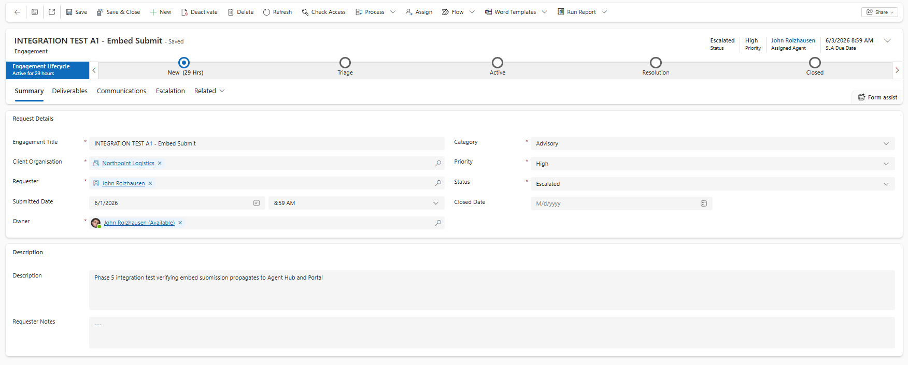
*An engagement submitted through the embedded Copilot agent, shown in the staff Agent Hub. The intake-routing flow has auto-populated the assigned agent and SLA due date, and the business process flow is active, all triggered by the original conversational submission.*

The intake router is the flow at the center of that cascade. It reads the SLA configuration, branches on whether a configuration was found, calculates the due date, resolves and assigns the default agent, sends the requester a branded confirmation, and writes an audit record.

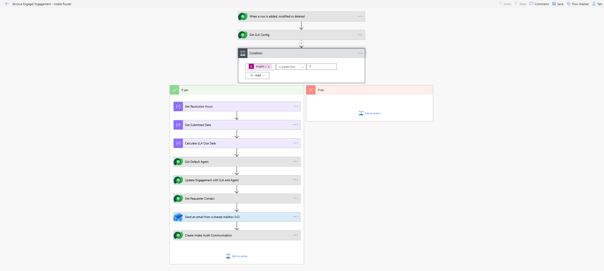
*The intake router: conditional logic that looks up SLA configuration, calculates the due date, assigns an agent, notifies the requester, and records an audit entry.*

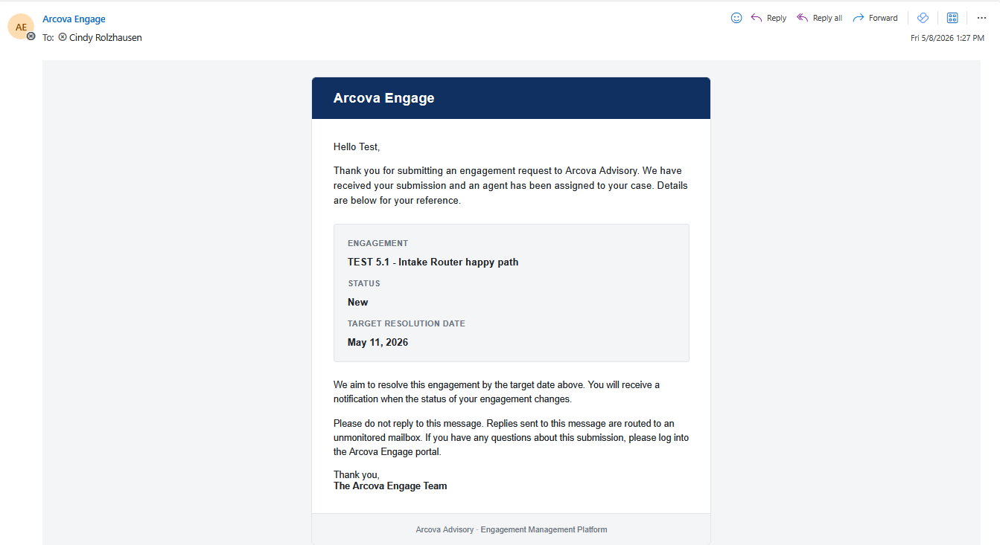
*The branded confirmation email the intake router sends to the requester, with the engagement details and target resolution date.*

The point is not any single flow, it is that each phase was deliberately built to be consumed by the ones above it, so the system behaves as a coherent whole rather than a set of disconnected features.

### Embedding the Copilot agent with single sign-on

Phase 5's headline was embedding the Arcova Assist Copilot Studio agent directly inside the canvas Client Portal, with the signed-in user's identity flowing through automatically so there is no second login. This turned out to be more involved than a simple control drop. The built-in Copilot control for canvas apps had been deprecated, and its official successor was still in preview and oriented toward structured data responses rather than hosting a custom conversational agent. The working path was a PCF (Power Apps Component Framework) control built on the Microsoft 365 Agents SDK, which required registering an application in Microsoft Entra ID, configuring it as a single-page application with the correct redirect URIs and the Copilot invoke permission, granting admin consent, and wiring four identifiers into the control. The result is a genuinely seamless embed: a requester opens the portal already signed in, and the agent greets them by name and resolves their organization without ever prompting for credentials. Account-scoped security carries through, so a requester only ever sees their own organization's records, which was confirmed by testing that another account's engagement never appears in a given user's results.

### Adaptive cards: discovering the supported binding mechanism

The Copilot agent presents engagement details using Adaptive Cards, and getting data to bind into those cards reliably took real investigation. The industry-standard approach (JSON cards with `${variable}` placeholders) has no clean binding surface in the current Copilot Studio version; the variable references simply do not resolve through any exposed UI. After working through several dead ends, the supported mechanism turned out to be the Formula card format: a Power Fx record literal where variable references resolve at runtime through the expression engine. The cards render identically to what the JSON approach would have produced, but the binding actually works. A related discovery surfaced during the embed: Adaptive Card container styles render with higher fidelity in the embedded WebChat surface than in the Copilot Studio authoring pane, so a card styled to signal success appears with a full colored band in the embed where the authoring preview showed only a subtle tint. The broader lesson, which recurred throughout the Copilot work, was to treat platform documentation as directional and verify behavior against the actual product.

> A fuller catalog of platform findings, including the resolution of a control render-loop, delegation-safe query patterns, a fire-and-forget HTTP pattern for long-running flows, and timezone handling across the flow-to-agent boundary, is documented in the per-phase write-ups linked below.

---

## How it was built, phase by phase

The project was built and documented in phases, each with its own detailed write-up. The phase documents contain the full architectural rationale, the lessons learned, and the patterns established along the way.

**Phase 0: Foundation.** The Power Platform environment, the solution and publisher, and the Dataverse schema: Account, Contact, Engagement, Deliverable, Communication, and SLA Config tables with their relationships. [`PHASE_0.md`](docs/phases/PHASE_0.md)

**Phase 1: Agent Hub.** The model-driven staff application: custom security role, forms, views, a business rule, a business process flow, dashboards, and a full set of seeded test data. [`PHASE_1.md`](docs/phases/PHASE_1.md)

**Phase 2: Client Portal.** The canvas client application: identity resolution, a design-token system, five screens, persistent navigation, and full create-and-read operations against Dataverse with delegation-safe filtering. [`PHASE_2.md`](docs/phases/PHASE_2.md)

**Phase 3: Automation.** Seven Power Automate flows forming the automation backbone: auto-timestamps, status-change notifications, intake routing with SLA calculation, scheduled SLA breach alerts, a closure approval workflow, and an externally callable escalation endpoint. [`PHASE_3.md`](docs/phases/PHASE_3.md)

**Phase 4: Copilot Agent.** The Arcova Assist agent: Entra authentication, a Dataverse knowledge source, and four authored topics covering status checks, deliverables, guided submission, and escalation, each backed by helper flows and Adaptive Cards. [`PHASE_4.md`](docs/phases/PHASE_4.md)

**Phase 5: Integration & Polish.** Embedding the agent in the Client Portal with single sign-on, end-to-end integration testing across all four surfaces, and the portfolio documentation: personas, architecture diagram, and this README. [`PHASE_5.md`](docs/phases/PHASE_5.md)

---

## Repository structure

```
arcova-engage/
├── README.md                      This file
├── PROJECT_BRIEF.md               The original project brief and scope
│
├── docs/
│   ├── architecture/
│   │   └── architecture.md        Solution architecture diagram (Mermaid)
│   ├── requirements/
│   │   └── DATA_MODEL.md          Full Dataverse schema: tables, columns, relationships
│   ├── personas/
│   │   └── personas.md            Roles and user stories
│   └── phases/
│       ├── PHASE_0.md             Foundation: environment, solution, schema
│       ├── PHASE_1.md             Agent Hub (model-driven app)
│       ├── PHASE_2.md             Client Portal (canvas app)
│       ├── PHASE_3.md             Automation (seven Power Automate flows)
│       ├── PHASE_4.md             Copilot agent (Arcova Assist)
│       └── PHASE_5.md             Integration and polish
│
├── flows/
│   ├── email-template-base.html   Branded HTML email template (Phase 3)
│   └── escalation/
│       └── escalation-notifier-test.http   REST Client test template (Phase 3)
│
└── screenshots/
    ├── phase-1/                   Agent Hub build evidence
    ├── phase-2/                   Client Portal build evidence
    ├── phase-3/                   Flow build and test evidence
    ├── phase-4/                   Copilot agent build and test evidence
    └── phase-5/                   Embed, integration testing, final docs
```

Each phase document is a standalone narrative: what was built, why each decision was made, the problems encountered, and how they were resolved. The phase documents are the best place to understand the reasoning behind the solution, not just its final shape.

---

## A note on how this was built

This project was built with the help of AI (Anthropic's Claude) as a collaborative tool. I used it as a project-management partner and a sounding board: to research current platform behavior, think through architectural options, refine the documentation in this repository, and work through debugging when the platform behaved in undocumented ways.

The architecture, the design decisions, the actual build across every surface, and the testing were mine. The AI accelerated the work and sharpened the writing; it did not make the engineering choices or do the building. I have noted this openly because transparency about tools matters, and because knowing how to use AI well as a force multiplier is itself part of how modern Power Platform work gets done.

---

## About

I am a Microsoft Power Platform developer with hands-on experience across Power Apps, Power Automate, Dataverse, and SharePoint. Arcova Engage is a portfolio project demonstrating that I can design and build a complete, multi-surface solution on the platform, from the data model up through the apps, automation, and an integrated Copilot agent.

**Certifications**
- PL-900: Microsoft Power Platform Fundamentals
- AB-730: AI Business Professional
- AB-410: Intelligent Applications Builder Associate (in progress)

**Microsoft Applied Skills**
- Create and manage canvas apps with Power Apps
- Create and manage model-driven apps with Power Apps and Dataverse
- Create and manage automated processes by using Power Automate
- Create agents in Microsoft Copilot Studio

**Contact**
- LinkedIn: [linkedin.com/in/johnrolzhausen](https://www.linkedin.com/in/johnrolzhausen)
- Email: [john.rolzhausen@live.com](mailto:john.rolzhausen@live.com)

---

*Arcova Engage is a portfolio project. Arcova Advisory is a fictional company and all data is seeded test data.*
