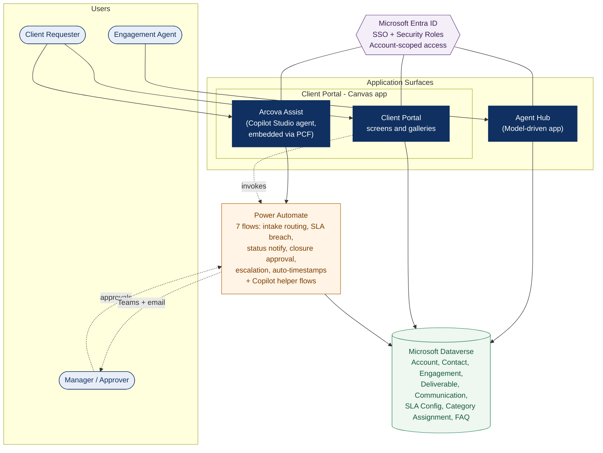

# Arcova Engage: Solution Architecture

A high-level view of how the four surfaces, the automation layer, and the Dataverse data model relate. This diagram renders natively in GitHub.

---

## How to read this diagram

**Users (top).** Three roles drive the system: the **Engagement Agent** (internal staff), the **Client Requester** (client-side contact), and the **Manager / Approver** (a senior agent who approves closures and is notified of escalations). These map to the profiles in `personas.md`.

**Application surfaces (middle).** Agents work in the model-driven **Agent Hub**. Requesters use the canvas **Client Portal**, which now hosts the **Arcova Assist** Copilot Studio agent embedded directly in its Chat screen via a PCF control. The nesting in the diagram reflects that the agent lives inside the portal rather than as a separate destination.

**Identity (cross-cutting).** Microsoft Entra ID provides single sign-on and the security model. All three surfaces resolve the signed-in user to their Dataverse identity, and account-scoping ensures requesters see only their own organization's records.

**Automation.** The seven Power Automate flows handle data hygiene, notifications, SLA enforcement, closure approvals, and escalation, plus the helper flows that shape data for the Copilot agent. The agent reaches Dataverse through these flows rather than querying directly.

**Data (bottom).** A single Dataverse data model underlies every surface. The full schema, including columns and relationships, is documented in `DATA_MODEL.md`.

The defining characteristic of the architecture is that two distinct front-end experiences, staff and client, plus a conversational agent, all sit on one shared data model with one shared automation backbone. Each layer consumes the ones beneath it.
